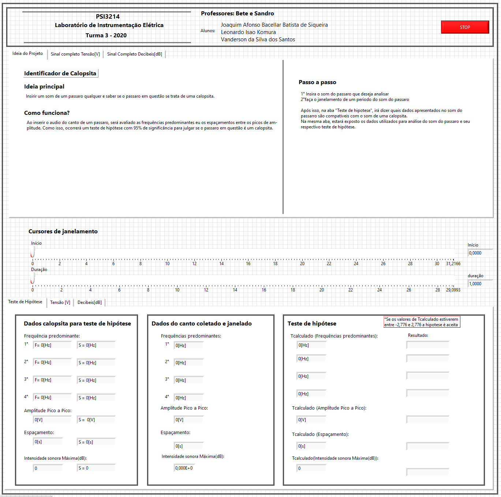
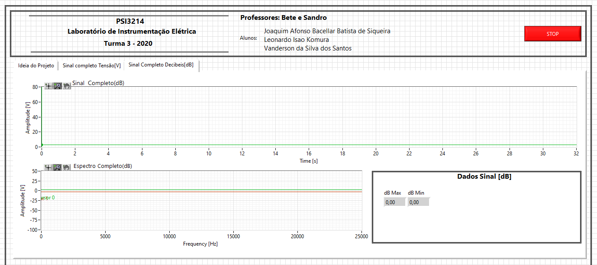
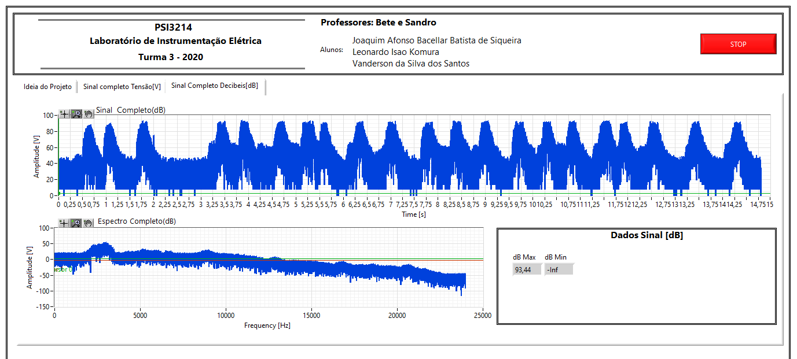
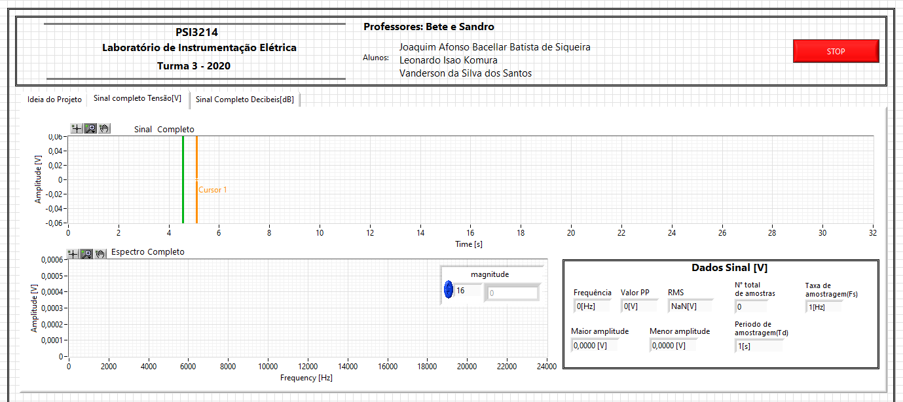
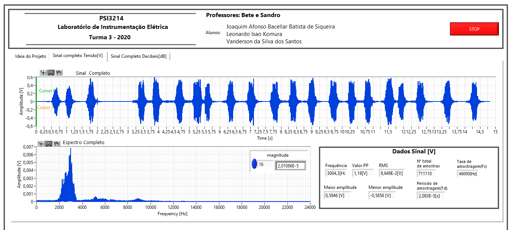
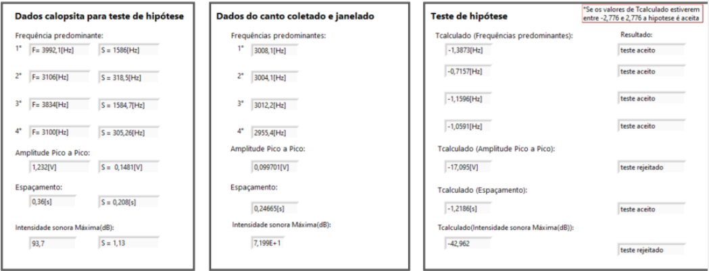

  
  

# 🎹 [PSI3214 - Laboratório de Instrumentação Elétrica](https://uspdigital.usp.br/jupiterweb/obterDisciplina?sgldis=PSI3214) - 2020

> Diciplina do segundo semestre de 2020 com intuito de desenvolver um projeto com a ferramenta LABView

## 🐦 Identificação de Pássaros

Para o projeto final da disciplina, a proposta foi desenvolver um sistema que a partir diversos testes de hipóteses pudesse, com determinada precisão, identificar se determinado canto pertencia a algum pássaro do acervo do projeto.

### 💥 Interface

  
  

  
  

### 👌 Resultados

Por fim, na imagem acima pode se observar a série de teste de hipóteses para uma possivel tentativa de identificar um passáro
